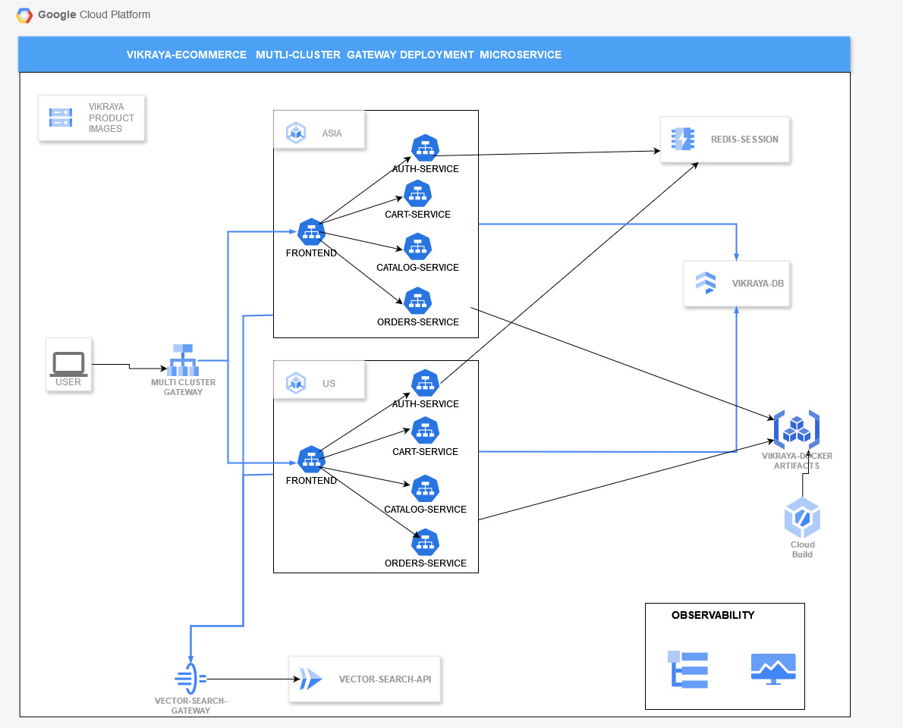

# Vikraya - Your Online Shopping Destination

A cloud-based e-commerce platform built with microservices on the Google Cloud Platform. 

## Description

See the [DESCRIPTION.md](Description.md) file for a detailed overview of Vikraya's features, architecture, and technologies.

## Setup

Refer to the [SETUP.md](setup.md) file for installation and configuration instructions. *[Note: You'll need to create this file with the detailed instructions]*

## Architecture Diagram 

## Technologies used
*  **Kubernetes Deployments,Services**   :  To deploy the microservices
*  **Cloud MemoryStore-Redis**: for centralised management of user sessions  for user authentication instead of using sticky session affinities which makes scalability inflexible
*  **Anthos Service Mesh**: To leverage **istio** mesh capabilities like virtual services and gateways
*  **Cloud Logging and Cloud Monitoring**:  To increase **observability** into applications using  native  logging,prometheus-client libraries
*  **Firestore**:  To store users,catalog,cart,orders data
*  **CloudRun**:  To perform a **vector search** over product description and name embeddings to generate customised search results
*  **API-Gateway**: To secure the cloud run service and allowing by authenticating a request  using an api key
*  **Cloud Storage**: To store the static files of website and made them publicly available

## Website images
##### Home page

##### Categories page

##### user-registration 

##### orders-page

